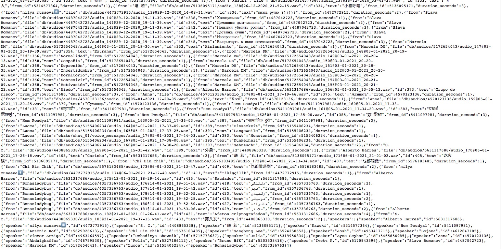
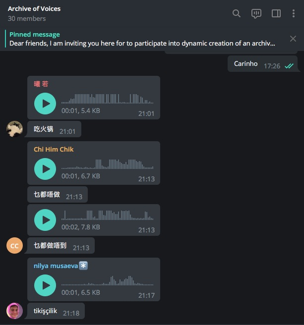
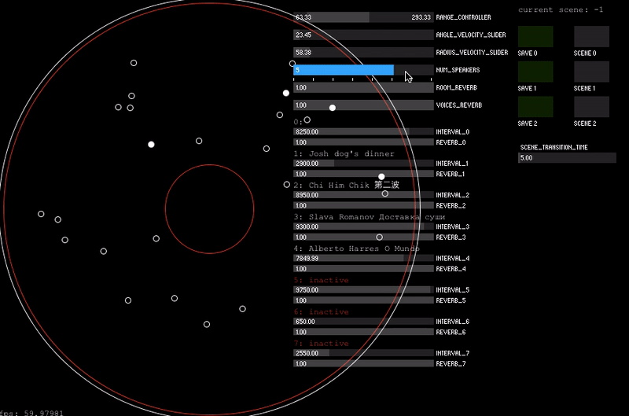
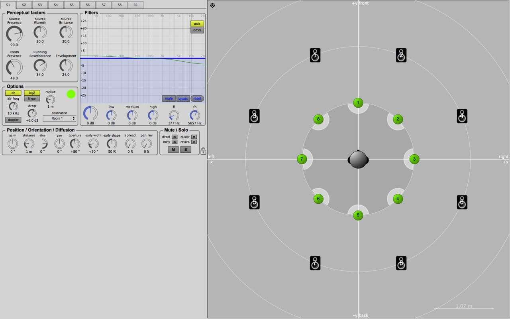

## information
* Title: The Pandemic Archive of Voices
* Student/s: Alberto Harres
* Course Title: These Designs Will Fix the World
* Lecturer/s: Prof. Dennis P. Paul
* Year: WS 2020/21
 

 
## The Archive
 
The Pandemic Archive of Voices is an audio archive constituted by 24 different speakers who contributed 185 audios in 18 different languages. Each of these audios represents a word or expression in the speaker's native language that would translate their own individual experience of the current context of the pandemic.
 

 
The collection of these audios was made possible through a telegram group, where each participant was invited to collaborate sending audio messages together with their written form to the telegram group.
 

 
[Step-by-step to extract audios from telegram and create json file.](https://github.com/mneunomne/pandemic-archive-of-voices-DB#step-by-step-to-extract-audios-from-telegram-and-create-json-file)
 
## The Installation
 
The idea of designing an audio-visual installation came from both the result of the development of the [Audio Piece]() and the simulations experiments, where it became clear that *spatiality* was a central aspect of how this Archive could manifest itself in an empathetic way. For that matter I invited the collaboration of Chi Him Chik, a fellow student of the Digital Media Master Program, who became responsible for the Sound Design of the installation, together with the general concept of its display.
 
The installation developed into a first prototype which comprised of an 8 channel audio installation with video mapping comprising of 3 programatic layers:
 
### Controller API (Processing)
 
API with a Graphical User Interface controlling the general *orchestration* of the archive in the installation, controlling the movement of each "virtual body", the amount of speaking voices, the distance from the center point, and set scenes and transitions between states.
 
[Github Repository - Source Code](https://github.com/mneunomne/paov_installation_api)
 

 
### Spatial Audio (MAX/MSP)
 
Using [SPAT](https://forum.ircam.fr/projects/detail/spat/), Chi Him developed the software that took the voices and movements data coming from the API and played them in a virtual space which simulates the audible spatial experience with multi-channel audio systems.
 

 
### Visual Projection (Projection)
 
[Github Repository - Source Code](https://github.com/mneunomne/paov_installation_vis)
 
Rendered the textual form of the played audios in a circular manner, respecting the same position where the audio is being played from in the spatial setup.
 

 
### Abstract
 
```
The living body is the central object of all politics.
```
*Paul B. Preciado, Learning from the Virus*

The installation places collected voices as an audio visual experience. Collected voices that seek to express their own particular individual experience of the context of the pandemic.

Reflecting the global aspect of this hyper-event, this is intended as a language-specific experience, exploring and indeterminacy of languages and how they interact and collide with each other while orbiting the present time of uncertainty.

This dynamic archive of voices seeks to create a collective experience of sharing, a singular meditative space of communion among the diversity of subjective perspectives during this time of collective struggle.

### Simulation
 
Simulation of how the final display of the installation would look like:
 

 
## Speakers
 
*I thank all collaborators that contributed with audios for the development of this project:*
 
```
 ["nilya musaeva","S. C.","ruoxi","Kazuki",
 "Hem","Antônio","Chi Him","Sangbong",
 "Alberto Harres","Josh","Bojana","Victor",
 "Debaditya","Julia","Ayse Seyhan","Anna",
 "Abdulghaffar","Pelin","Bruno","Ivett K.",
 "Slava Romanov","Marcela DM","Lucca","Bonasladybug",
 "Soumya"]
```
 
## Links
 
- [Modulation to the fly podcast](https://www.mixcloud.com/soundstudies/modulation-18-alberto-harres/)
- [FoxDot synths used for the audio piece](https://github.com/mneunomne/pandemic-audio-piece-foxdot)
- [Recorded audio from installation - Soundcloud](https://soundcloud.com/mneu_nomne/pandemic-archive-of-voices)
- [Installation Controller API](https://github.com/mneunomne/paov_installation_api)
- [Installation Visuals](https://github.com/mneunomne/paov_installation_vis)
 
## Further Reading
 
- [THE ARCHIVIST MANIFESTO, Yuk Hui - 2013](https://www.metamute.org/editorial/lab/archivist-manifesto)
- [LEARNING FROM THE VIRUS, Paul B. Preciado](https://www.artforum.com/slant/paul-b-preciado-on-life-after-covid-19-82586)

